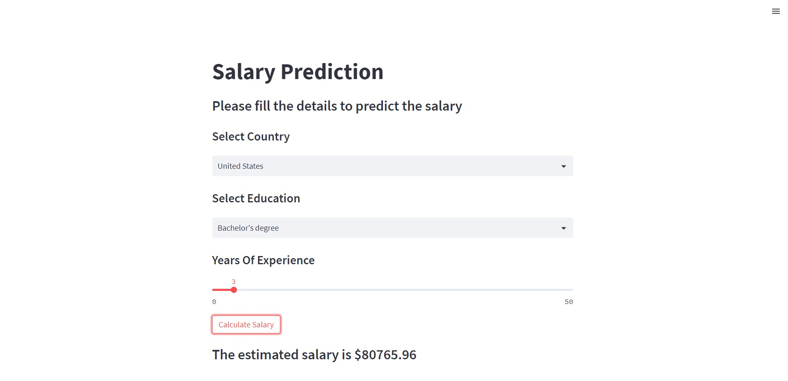
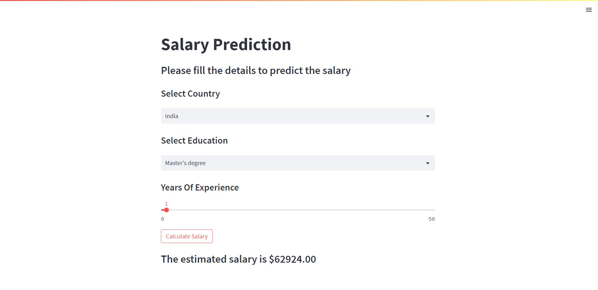

# Salary Prediction using Decision Tree

#### Used StreamLit for Web View

Screenshots below
<br>



### Note
1. Download the Code (https://github.com/indira1vik/salary-prediction-streamlit.git)
2. If survey_results_public.csv error, please look into this website (https://insights.stackoverflow.com/survey) for data.
3. Run all the codes in Book.ipynb
4. A File called Model_Pickle_File.pkl will be created
5. Final step is to type ```streamlit run App.py``` in terminal.
6. You can see website running in ```localhost:8501```
